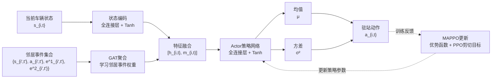

# 图3 改进MAPPO策略网络结构图逻辑关系稿

## 图的核心表达

本图用于说明改进MAPPO策略网络的前向决策逻辑：当前车辆状态和邻居车辆异步到站事件分别编码，其中邻居事件通过GAT进行注意力聚合；随后将两类特征融合，输入Actor策略网络，输出驻站动作分布参数，并生成当前车辆的驻站动作。

## 建议流程图

## 节点含义

| 节点 | 含义 | 图中建议表达 |
|---|---|---|
| 当前车辆状态 | 当前车辆自身可观测状态，如前向车头时距、后向车头时距、车内乘客数等 | 蓝色输入框 |
| 邻居事件集合 | 与当前车辆决策相关的其他车辆到站事件，包括邻居状态、动作和事件图边特征 | 绿色输入框 |
| 状态编码 | 将当前车辆状态映射为高维特征表示 | 蓝色处理框 |
| GAT聚合 | 对邻居事件分配注意力权重，得到邻居事件影响向量 | 绿色处理框，突出“改进点” |
| 特征融合 | 合并当前车辆自身状态特征和邻居事件影响特征 | 中性灰色或浅蓝色融合框 |
| Actor策略网络 | 根据融合特征生成动作分布 | 红色或暖色处理框 |
| 均值、方差 | 连续动作分布的两个参数 | 两个并列输出框 |
| 驻站动作 | 当前车辆最终执行的驻站控制动作 | 终点输出框 |
| MAPPO更新 | 训练阶段根据优势函数和PPO剪切目标更新策略 | 底部弱化框，建议用虚线反馈 |

## 连接线建议

1. 主决策流程使用实线箭头，从左到右表示信息流。
2. 当前车辆状态支路和邻居事件支路在“特征融合”处汇合。
3. `Actor策略网络 -> 均值/方差 -> 驻站动作` 应使用清晰箭头，说明连续动作由分布参数生成。
4. 底部MAPPO更新属于训练反馈，不属于执行时前向决策流程，建议使用浅灰色虚线箭头。
5. 箭头尽量横平竖直，减少斜线；如果必须转向，优先使用直角折线。

## 可放入图注的表述

改进MAPPO策略网络结构。当前车辆状态经全连接层编码后，与由GAT聚合得到的邻居事件影响特征进行融合；融合特征输入Actor策略网络，输出连续驻站动作分布的均值和方差，并生成驻站动作。训练阶段通过优势函数和PPO剪切目标更新策略参数。

