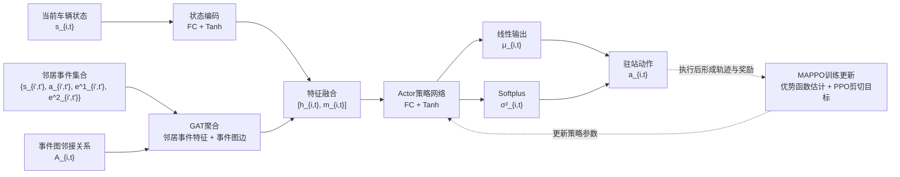

# 图3 改进MAPPO策略网络结构图审图意见

## 总体判断

当前图3的主逻辑基本成立：左侧为输入信息，中间为事件图注意力增强编码，右侧为策略网络输出。该结构能够表达“当前车辆状态 + 邻居异步到站事件信息 → GAT聚合 → 策略网络 → 驻站动作”的核心思路。

后续修改重点不是大幅重画，而是补强几个容易被审稿人追问的逻辑点。

## 建议修改点

### 1. 补出事件图结构输入

当前绿色输入框强调了“邻居事件集合”，但GAT不仅需要节点/事件特征，也需要事件图中的邻接关系或边信息。

建议在绿色输入框或GAT框旁补充：

```text
事件图邻接关系 A_{i,t}
```

或者将“GAT聚合 事件影响”改为：

```text
GAT聚合
邻居事件特征 + 事件图边
```

这样可以更清楚地说明：GAT不是简单处理一组邻居特征，而是在事件图结构约束下学习邻居事件权重。

### 2. 简化“+”与“特征融合”的重复表达

当前图中既有“+”符号，也有“特征融合”框。二者逻辑上都表示融合，但同时出现会让读者不确定融合到底发生在哪里。

建议二选一：

```text
方案A：保留“+”，后面的框改为“融合特征表示”
方案B：删除“+”，两条箭头直接进入“特征融合”框
```

更推荐方案B。论文图会更干净，也更容易理解。

### 3. 输出变量建议加上下标

右侧“均值”“方差”“驻站动作”建议统一加上下标，与输入状态 `s_{i,t}` 对应。

建议改为：

```text
均值 μ_{i,t}
方差 σ^2_{i,t}
驻站动作 a_{i,t}
```

这样读者可以明确：这些输出对应当前车辆 `i` 在时刻 `t` 的驻站决策。

### 4. 方差分支建议体现正值约束

原始策略网络中方差通常需要经过 `Softplus` 等函数，以保证方差为正。当前右侧如果只写“全连接层 + Tanh”，容易被误解为均值和方差都经过相同激活后直接输出。

建议将右侧输出分支改成：

```text
线性输出 → μ_{i,t}
Softplus → σ^2_{i,t}
```

如果图面空间不足，可以在“方差”框内写：

```text
Softplus
σ^2_{i,t}
```

### 5. 底部MAPPO更新建议改得更严谨

当前“MAPPO更新：优势函数 + PPO剪切目标”的方向基本正确，但训练更新并不是由动作本身直接产生，而是由执行动作后得到的轨迹、奖励和价值估计共同决定。

建议将底部文字改为：

```text
轨迹与奖励 → 优势函数估计 → PPO剪切更新
```

或简化为：

```text
基于轨迹奖励的MAPPO更新
```

底部反馈箭头建议使用浅灰色虚线，并指回“Actor策略网络”或“策略网络参数”，不要画得太强，以免和前向决策流程混淆。

### 6. 是否加入Critic的判断

如果图名仍为“改进MAPPO策略网络结构图”，当前只画Actor策略网络是可以的。

但如果底部保留“优势函数估计”，建议加入一个小型辅助框：

```text
Critic估计 V(s)
```

并让其参与“优势函数估计”。这样逻辑上更完整。

如果不想加入Critic，建议弱化底部训练细节，把底部写成：

```text
MAPPO训练更新
```

避免图中出现优势函数却没有价值网络来源的问题。

## 推荐修改后的逻辑流程



## 图注建议

```text
改进MAPPO策略网络结构。当前车辆状态经全连接层编码后，与由事件图注意力网络聚合得到的邻居事件影响特征进行融合；融合特征输入Actor策略网络，输出连续驻站动作分布的均值和方差，并生成当前车辆的驻站动作。训练阶段基于轨迹奖励、优势函数估计和PPO剪切目标更新策略参数。
```

